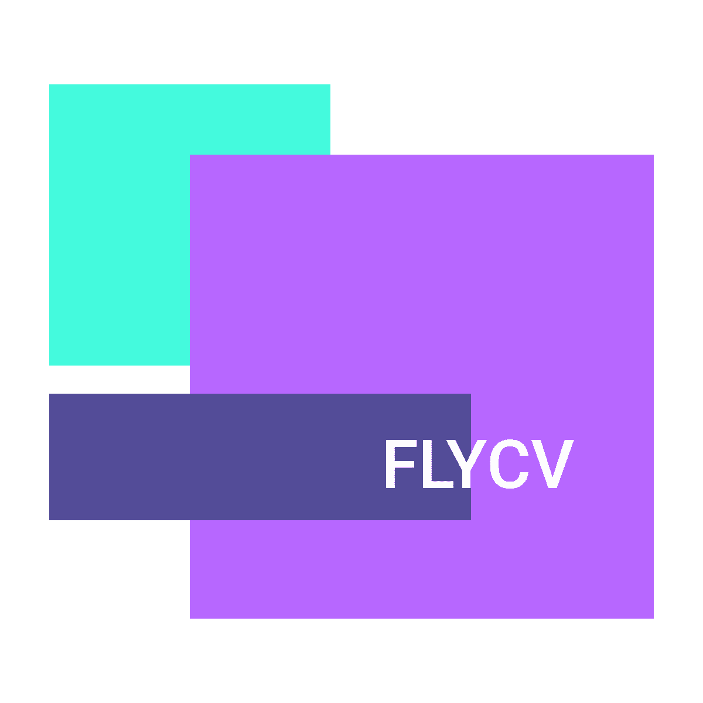

# 🔥 FlyCV —— High-performance Computer Vision System

FlyCV is a high-performance library for processing computer visual tasks. We have done a lot of optimization on the arm side，making it faster than many other image processing libraries. And at the same time, we are also starting optimization work on other CPU platforms，heterogeneous computing platforms. Not only faster，compared to other image processing libraries, it provides us with more fine-grained compilation options and is lighter in size.

## :notebook: Documentation

### API Documentation
To make it easier for everyone, our interface design is close to OpenCV. Howerver, there are some differences between the two.
 
Just see the interface documentation for more details: 

[📖 API Documentation](https://github.com/PaddlePaddle/FlyCV/wiki/API-Documention)

### Compile from source
We support most major operating systems, including android, armlinux, macos(x86 & arm), windows, ios. 
 
You can compile from source by following the documentation below.
 

 
<style="font-size:100px"><b>📖 Compile Documentation（Click to expand） </b>

 

 - [:books: v1.0](docs/en/v1.0/compile.md)

### Get released pacakges

Of course, you can also directly download the package we have released: [Released Packages](./)

## :pushpin: ChangeLog
Check the change log to get the changes for each version: [ChangeLog](docs/en/CHANGELOG.md)

## :two_men_holding_hands: Communication
<b>Ruliu:</b> Scan the QR code with Ruliu App to chat with other members about ideas.

## :pencil2: Contributing
See the [CONTRIBUTING.md](./CONTRIBUTING.md) to get start with the contribution. Thanks for everyone's contributions.

## :copyright: License
[Apache-2.0](./License)
