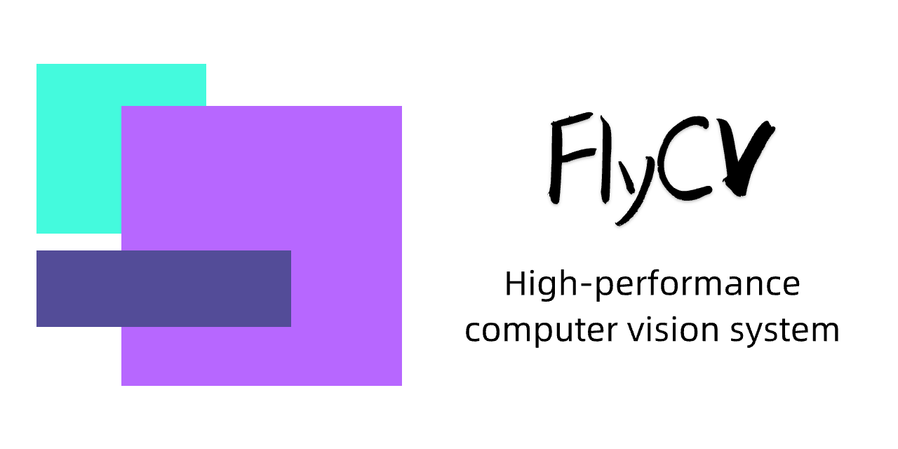

**[English](README_EN.md)** | **简体中文**

## 🔥 FlyCV —— 高性能计算机图像系统

FlyCV是一个高性能的计算机视觉任务处理库。我们目前在arm架构下做了很多优化，相比其他图像处理库性能更为出色。同时，我们也正在开展其他CPU和异构平台的性能优化工作，例如x86，RISC-V，GPU，DSP等。除了速度更快之外，FlyCV提供了更加细粒度的编译选项控制，在库体积上会更加轻量。

下面通过一个例子可以简单体验一下FlyCV和OpenCV在性能和效果上的差异。

FlyCV的效果和OpenCV基本对齐，但速度相比OpenCV有非常明显的提升。

 

## :notebook: 文档

### API 文档

为了便于大家集成使用，我们的接口设计和OpenCV非常接近，但也存在一些差别，可以通过下面的接口文档了解更多的细节：

[📖 API 文档](https://github.com/PaddlePaddle/FlyCV/wiki/API-Documents)

### 源码编译

我们支持大多数主流的操作系统，包括android、armlinux、macos（x86 & arm）、windows，以及ios。

根据下面的文档可以从源码进行编译：
 

[:book: 编译手册](https://github.com/PaddlePaddle/FlyCV/wiki/Compile-manual)

### 预编译库

当然你也可以直接下载我们已经编译好的一些库：[预编译库下载]()

## :pushpin: 升级日志

可以通过我们的升级日志查看每个版本的变化：[升级日志](docs/en/CHANGELOG.md)

## :two_men_holding_hands: 技术交流

扫描下面的二维码加入我们的技术交流群，一起探讨计算机视觉领域的图像处理方法和优化工作。

&nbsp;&nbsp;&nbsp;&nbsp;&nbsp;&nbsp;&nbsp;&nbsp;

## :pencil2: 贡献代码

非常欢迎大家一起来贡献代码，我们提供了详细的文档以便于大家可以快速集成，具体细节可以查阅 [CONTRIBUTING.md](./CONTRIBUTING.md) ，在这里感谢每一个人的努力付出。

## :copyright: License
[Apache-2.0](./License)
